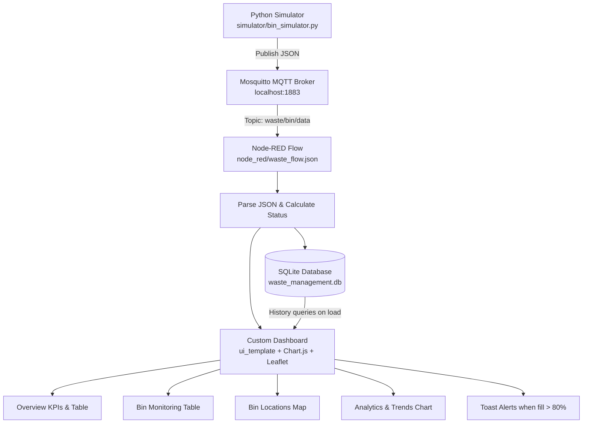

# Smart Waste Management System

A local, end-to-end waste monitoring system that simulates 5 garbage bins in Pune, India, publishes telemetry over MQTT, processes data in Node-RED, stores history in SQLite, and displays a custom dark-themed dashboard with maps, charts, and alerts.

---

## Overview

Urban waste collection is often reactive: bins overflow before trucks are dispatched, routes are inefficient, and historical data is rarely available.

This project digitizes bin monitoring for demonstration and academic use. A Python simulator generates realistic fill-level and weight data for five fixed locations in Pune, publishes JSON messages every 5 seconds to a local Mosquitto broker, and Node-RED ingests that stream, classifies each reading, writes rows to SQLite, and drives a single custom dashboard built with `ui_template`, Chart.js, and Leaflet.js.

There are no physical IoT sensors, cloud backends, or external databases in the current implementation.

---

## Features

| Feature | Implementation |
| :--- | :--- |
| **Waste bin simulation** | `simulator/bin_simulator.py` simulates 5 bins with gradual fill (5–15% per cycle), collection resets at >85%, and weight derived from a 50 kg capacity model |
| **MQTT communication** | Paho MQTT client publishes to `waste/bin/data` on `localhost:1883` every 5 seconds |
| **Node-RED processing** | Subscribes to MQTT, parses JSON, calculates status, builds SQL inserts, and routes data to SQLite and the dashboard |
| **SQLite data storage** | `waste_management.db` stores all telemetry in the `waste_data` table |
| **Analytics and monitoring** | Chart.js line charts track fill-level trends per bin with an 80% threshold line |
| **World map visualization** | Leaflet.js maps with CartoDB dark tiles show bin markers colored by status (green / orange / red) |
| **Fill-level monitoring** | Status badges, KPI counters, and toast alerts when fill level exceeds 80% |

---

## Architecture



**Data flow summary**

1. The simulator publishes one JSON message per bin per cycle.
2. Mosquitto forwards messages to the Node-RED MQTT In node.
3. Node-RED parses the payload, assigns `Normal` / `Warning` / `Critical`, and fans out to SQLite insert and the dashboard template.
4. On dashboard load, the UI requests the last 200 records and total row count from SQLite.
5. The custom dashboard renders tables, maps, charts, and client-side toast alerts.

---

## Project Structure

```text
smart-waste-management/
├── .gitignore                      # Ignores venv, Python caches, OS files
├── README.md                       # Main project documentation
├── requirements.txt                # Python dependencies (paho-mqtt)
├── waste_management.db             # SQLite database (created/populated at runtime)
├── docs/
│   ├── deployment_guide.md         # Background services and presentation guide
│   ├── installation_guide.md       # Step-by-step setup instructions
│   └── testing_guide.md            # Verification procedures for each component
├── node_red/
│   ├── dashboard.html              # Source markup/CSS/JS for the custom dashboard
│   ├── update_flow.py              # Embeds dashboard.html into waste_flow.json
│   ├── waste_flow.json             # Active Node-RED flow export (import this file)
│   └── waste_flow.json.bak         # Legacy multi-widget flow backup (reference only)
├── screenshots/
│   └── dashboard_mockup.svg        # UI mockup illustration
├── simulator/
│   └── bin_simulator.py            # MQTT waste bin simulator
└── sql/
    └── database_schema.sql         # SQLite schema definition
```

---

## Technology Stack

| Layer | Technology |
| :--- | :--- |
| Simulator | Python 3.x |
| MQTT client | Paho MQTT (`paho-mqtt<2.0.0`) |
| MQTT broker | Mosquitto (`localhost:1883`) |
| Flow engine | Node-RED |
| Dashboard host | `node-red-dashboard` (`ui_template`, `ui_base`, `ui_tab`, `ui_group`) |
| Database integration | `node-red-node-sqlite` |
| Database | SQLite 3 (`waste_management.db`) |
| Data format | JSON |
| Charts (CDN) | Chart.js 4.4.1 |
| Maps (CDN) | Leaflet 1.9.4 with CartoDB dark basemap tiles |
| Fonts (CDN) | Google Fonts — Outfit |

> **Note:** The active flow uses a custom `ui_template` dashboard with Chart.js and Leaflet loaded from CDN. The legacy `waste_flow.json.bak` used `node-red-contrib-web-worldmap` and separate dashboard widgets; those are **not** required for the current implementation.

---

## Installation

See [docs/installation_guide.md](docs/installation_guide.md) for full details. Summary:

1. **Clone the repository**
   ```bash
   git clone <repository-url>
   cd smart-waste-management
   ```

2. **Create a virtual environment**
   ```bash
   python -m venv venv
   ```

3. **Activate the virtual environment**
   - PowerShell: `.\venv\Scripts\Activate.ps1`
   - CMD: `.\venv\Scripts\activate.bat`

4. **Install Python requirements**
   ```bash
   pip install -r requirements.txt
   ```

5. **Install Mosquitto**
   - Download from [mosquitto.org/download](https://mosquitto.org/download/)
   - Ensure the broker service is running on port `1883`

6. **Install Node.js and Node-RED**
   ```bash
   npm install -g --unsafe-perm node-red
   ```

7. **Install Node-RED packages**
   - `node-red-dashboard`
   - `node-red-node-sqlite`

   Via Palette Manager (**Menu → Manage palette → Install**) or CLI:
   ```bash
   cd %USERPROFILE%\.node-red
   npm install node-red-dashboard node-red-node-sqlite
   ```

8. **Import the Node-RED flow**
   - Open `http://localhost:1880`
   - **Menu → Import** → paste contents of `node_red/waste_flow.json`
   - Choose **Import to New Flow**

9. **Configure the SQLite database path**
   - Double-click the **Save to SQLite** node
   - Edit the database config path to your absolute `waste_management.db` location
   - Default in the flow: `D:/smart-waste-management/waste_management.db`

10. **Deploy the flow**
    - Click the red **Deploy** button

---

## Running the Project

Start components in this order:

| Step | Command / Action |
| :--- | :--- |
| 1. MQTT broker | Ensure Mosquitto is running (`net start mosquitto` on Windows) |
| 2. Node-RED | `node-red` → editor at `http://localhost:1880` |
| 3. Simulator | `python simulator/bin_simulator.py` (with venv active) |
| 4. Dashboard | Open `http://localhost:1880/ui/` |

Optional: initialize the database manually before first run:
```bash
sqlite3 waste_management.db < sql/database_schema.sql
```
Node-RED uses SQLite mode `RWC` (read-write-create), so the file is created automatically if missing.

---

## Dashboard Access

**URL:** [http://localhost:1880/ui/](http://localhost:1880/ui/)

The dashboard is a single Node-RED `ui_template` page with four internal navigation tabs. The default Node-RED sidebar is hidden; navigation uses the custom left sidebar.

### Page 1 — Overview

| Widget | Description |
| :--- | :--- |
| KPI: Total Monitored Bins | Fixed count of 5 bins |
| KPI: Normal (0–50%) | Bins with fill level ≤ 50% |
| KPI: Warning (51–80%) | Bins with fill level 51–80% |
| KPI: Critical (>80%) | Bins with fill level > 80% |
| System Diagnostics | Total records logged and last updated timestamp |
| Live Telemetry Table | Bin ID, fill level, weight, status |
| Live Pune Map View | Compact Leaflet map with status-colored markers |
| Fill Level Telemetry Trends (%) | Chart.js line chart (last 20 timestamps, 5 bin lines + 80% threshold) |

### Page 2 — Bin Monitoring

| Column | Description |
| :--- | :--- |
| Bin ID | e.g. `BIN001` |
| Location | Pune neighborhood name |
| Fill Level (%) | Current fill percentage |
| Weight (kg) | Simulated weight |
| Latitude / Longitude | GPS coordinates |
| Last Updated | Timestamp from latest reading |
| Status | Normal / Warning / Critical pill badge |

### Page 3 — Bin Locations Map

| Widget | Description |
| :--- | :--- |
| Fullscreen Leaflet map | Centered on Pune (`18.5314, 73.8567`, zoom 12) |
| Circle markers | One per bin; color reflects status |
| Popups | Bin ID, city, fill level, weight, and status on click |

Map tiles load from CartoDB (`basemaps.cartocdn.com`) and require an internet connection.

### Page 4 — Analytics & Trends

| Widget | Description |
| :--- | :--- |
| Fill level line chart (large) | Same data as Overview chart with legend and larger canvas |
| 80% threshold line | Red dashed reference line |
| Interactive legend | Click to show/hide individual bin datasets |

### Toast alerts

When a bin's fill level exceeds **80%**, a red toast appears in the top-right:

`Critical Threshold Alert — BIN00X (Pune (...)) is full at NN%!`

Toasts auto-dismiss after 8 seconds or can be closed manually. They clear when the bin drops back to ≤ 80%.

---

## Database Schema

Defined in [sql/database_schema.sql](sql/database_schema.sql). Single table:

### Table: `waste_data`

| Column | Type | Constraints | Description |
| :--- | :--- | :--- | :--- |
| `id` | INTEGER | PRIMARY KEY AUTOINCREMENT | Unique auto-increment row identifier for each logged reading |
| `bin_id` | TEXT | NOT NULL | Bin identifier (`BIN001` through `BIN005`) |
| `fill_level` | INTEGER | NOT NULL | Fill percentage from 0 to 100 |
| `weight` | INTEGER | NOT NULL | Simulated weight in kilograms (0 when empty; up to ~53 kg at 100% fill) |
| `latitude` | REAL | NOT NULL | GPS latitude of the bin location |
| `longitude` | REAL | NOT NULL | GPS longitude of the bin location |
| `timestamp` | TEXT | NOT NULL | Log time in `YYYY-MM-DD HH:MM:SS` format |
| `status` | TEXT | NOT NULL | Computed status: `Normal` (≤50%), `Warning` (51–80%), `Critical` (>80%) |

### Index

| Index | Columns | Purpose |
| :--- | :--- | :--- |
| `idx_waste_data_bin_timestamp` | `bin_id`, `timestamp` | Speeds up per-bin historical queries |

### Status classification (Node-RED + dashboard)

| Fill Level | Status |
| :--- | :--- |
| 0–50% | Normal |
| 51–80% | Warning |
| > 80% | Critical |

The simulator triggers a collection cycle when fill exceeds **85%** (independent of dashboard status thresholds).

---

## Configuration

### MQTT broker

| Setting | Value |
| :--- | :--- |
| Host | `localhost` |
| Port | `1883` |
| Topic | `waste/bin/data` |
| QoS | `0` |
| Publish interval | 5 seconds (simulator) |

### Database

| Setting | Value |
| :--- | :--- |
| File | `waste_management.db` (project root) |
| Flow default path | `D:/smart-waste-management/waste_management.db` |
| Node mode | `RWC` (read-write-create) |

### Simulated bins (Pune, India)

| Bin ID | Location | Latitude | Longitude |
| :--- | :--- | :--- | :--- |
| BIN001 | Pune (Kothrud) | 18.5074 | 73.8077 |
| BIN002 | Pune (Koregaon Park) | 18.5362 | 73.8940 |
| BIN003 | Pune (Shivajinagar) | 18.5314 | 73.8446 |
| BIN004 | Pune (Viman Nagar) | 18.5679 | 73.9143 |
| BIN005 | Pune (Hadapsar) | 18.5089 | 73.9260 |

### MQTT JSON payload (simulator output)

```json
{
  "bin_id": "BIN001",
  "fill_level": 42,
  "weight": 22,
  "latitude": 18.5074,
  "longitude": 73.8077,
  "timestamp": "2026-06-23 14:30:00"
}
```

Node-RED adds `status` before insert and dashboard display.

### Editing the dashboard UI

1. Modify `node_red/dashboard.html`
2. Regenerate the flow:
   ```bash
   python node_red/update_flow.py
   ```
3. Re-import or redeploy `node_red/waste_flow.json` in Node-RED

---

## Troubleshooting

### MQTT connection issues

**Symptoms:** Simulator prints `[ERROR] Connection failed` and retries every 5 seconds.

**Fixes:**
- Start Mosquitto: `net start mosquitto` (Windows, Administrator)
- Verify port: `netstat -an | findstr 1883`
- Confirm broker host in `simulator/bin_simulator.py` matches Node-RED MQTT config (`localhost:1883`)

### Node-RED not starting

**Symptoms:** `node-red` command not found or immediate crash.

**Fixes:**
- Verify install: `node -v` and `npm -v`
- Check port 1880: `netstat -ano | findstr 1880`
- Kill conflicting process: `taskkill /F /PID <pid>`

### Dashboard not loading

**Symptoms:** Blank page, `Cannot GET /ui/`, or missing template.

**Fixes:**
- Install `node-red-dashboard`
- Import and **Deploy** `node_red/waste_flow.json`
- Open `http://localhost:1880/ui/` (not just `:1880`)
- Ensure the simulator is running so live data appears

### World map not showing

**Symptoms:** Empty map area or gray tiles.

**Fixes:**
- Requires internet access for CartoDB map tiles and CDN scripts (Leaflet, Chart.js, Google Fonts)
- Run the simulator at least once so coordinates are available
- Check browser console for blocked CDN requests
- This implementation does **not** use `node-red-contrib-web-worldmap`; maps are rendered inside the custom template

### SQLite "failed to open database" error

**Symptoms:** Node-RED debug panel shows SQLite open/write errors.

**Fixes:**
1. Open Node-RED editor → double-click **Save to SQLite**
2. Click the pencil icon on the database config
3. Set the **Path** to the absolute path of `waste_management.db` on your machine
4. Click **Update** → **Done** → **Deploy**
5. Ensure the directory exists and is writable

### Missing Node-RED packages

**Symptoms:** Unknown node types after import (`sqlite`, `ui_template`, etc.).

**Fixes:**
```bash
cd %USERPROFILE%\.node-red
npm install node-red-dashboard node-red-node-sqlite
```
Restart Node-RED after installation.

### Port conflicts

**Symptoms:** `Error: listen EADDRINUSE` on 1880 or 1883.

**Fixes:**
```bash
netstat -ano | findstr 1880
netstat -ano | findstr 1883
taskkill /F /PID <pid>
```

---

## Future Enhancements

1. **Route optimization** — Compute efficient collection routes prioritizing critical bins
2. **Predictive analytics** — Forecast time-to-full from historical SQLite data
3. **Weight trend chart** — Restore a dedicated weight line chart (present in legacy flow only)
4. **Notifications** — Email or SMS alerts to collection crews
5. **Physical hardware** — Replace the simulator with real ultrasonic or load-cell sensors

---

## License

No `LICENSE` file is included in this repository. The project is intended for academic and demonstration use. Add an explicit license (for example, MIT) before public distribution.
